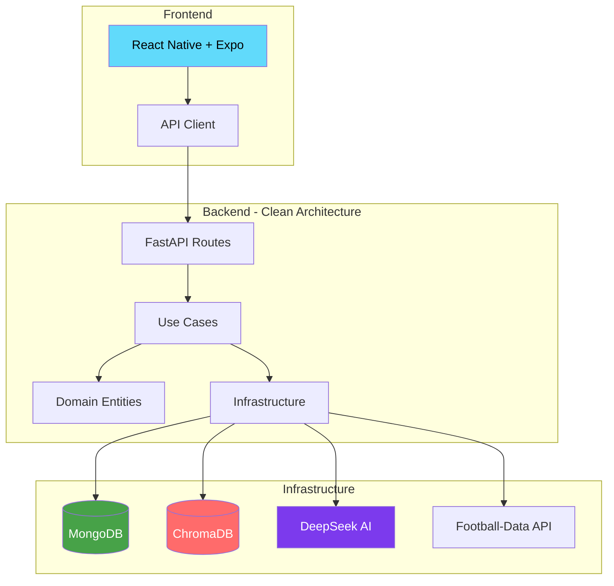

# GoalMind

<div align="center">


**AI-powered football prediction platform**

[Quick Start](#-quick-start) · [Architecture](#-architecture) · [Contributing](CONTRIBUTING.md) · [Docs](#-documentation)

</div>

---

## What is GoalMind?

GoalMind is an open-source football prediction platform powered by **Dixie**, an elite AI sports analyst. It combines:

- **DeepSeek AI** — Advanced LLM for tactical analysis and match predictions
- **ChromaDB RAG** — Vector database with FIFA-style player attributes
- **Live Data** — Real-time stats from Football-Data.org API
- **Cross-Platform App** — iOS, Android & Web with React Native + Expo

Supporting **50+ leagues worldwide**: Premier League, La Liga, Serie A, Bundesliga, Liga Pro Ecuador, MLS, Champions League, and more.

---

## Monorepo Structure

```
GoalMind/
├── futbolia-backend/       # FastAPI + Python backend
│   ├── src/
│   │   ├── core/           # Config, logging, cache
│   │   ├── domain/         # Entities (User, Team, Match, Prediction)
│   │   ├── infrastructure/ # MongoDB, ChromaDB, DeepSeek, APIs
│   │   ├── use_cases/      # Auth, Prediction logic
│   │   └── presentation/   # API routes
│   └── tests/              # Test suite
│
├── futbolia-mobile/        # React Native + Expo frontend
│   ├── app/                # Screens (Expo Router)
│   └── src/
│       ├── components/     # UI components
│       ├── services/       # API client
│       ├── theme/          # Styling
│       └── i18n/           # i18n (ES/EN)
│
├── scripts/                # Cross-platform setup & dev scripts
├── docs/                   # Architecture & troubleshooting docs
├── docker-compose.yml      # Full-stack Docker deployment
├── Makefile                # Task runner (Linux/macOS)
└── Taskfile.yml            # Task runner (cross-platform)
```

---

## Quick Start

### Prerequisites

| Tool | Version | Installation |
|------|---------|-------------|
| Python | 3.13+ | [python.org](https://python.org) |
| uv | latest | `curl -LsSf https://astral.sh/uv/install.sh \| sh` |
| Node.js | 22+ | [nodejs.org](https://nodejs.org) |
| Bun | latest | `curl -fsSL https://bun.sh/install \| bash` |
| MongoDB | 7+ | [mongodb.com](https://mongodb.com) or use Docker |

### Option A: Automated Setup

```bash
git clone https://github.com/OWNER/GoalMind.git
cd GoalMind

# Linux/macOS
make setup
make dev

# Windows (PowerShell)
.\scripts\setup.ps1
.\scripts\dev.ps1

# Cross-platform (requires Task: https://taskfile.dev)
task setup
task dev
```

### Option B: Docker (one command)

```bash
git clone https://github.com/OWNER/GoalMind.git
cd GoalMind

cp .env.docker.example .env
# Edit .env — set JWT_SECRET_KEY (required)

docker compose up --build
```

### Option C: Manual Setup

```bash
# Backend
cd futbolia-backend
cp .env.example .env    # Edit with your API keys
uv sync
uv run python -m uvicorn src.main:app --reload --host 0.0.0.0 --port 8000

# Frontend (in another terminal)
cd futbolia-mobile
cp .env.example .env
bun install
bun start
```

### Access Points

| Service | URL |
|---------|-----|
| Backend API | http://localhost:8000 |
| API Docs (Swagger) | http://localhost:8000/docs |
| Frontend (Expo) | http://localhost:8081 |
| Frontend (Docker) | http://localhost:3000 |

---

## Architecture



### Prediction Flow

```
User selects teams → Backend fetches player data from ChromaDB (RAG)
    → Sends context to DeepSeek AI (Dixie)
    → Dixie generates tactical analysis + prediction
    → Result saved to MongoDB → Displayed in app

Output: Winner, Score, Confidence %, Tactical Analysis, Key Factors
```

### Tech Stack

| Layer | Technology | Purpose |
|-------|-----------|---------|
| **Frontend** | React Native, Expo 54, NativeWind | Cross-platform UI |
| **Backend** | FastAPI, Python 3.13, uv | REST API |
| **Database** | MongoDB 7 + Motor | User data, predictions |
| **Vector DB** | ChromaDB | Player attributes (RAG) |
| **AI** | DeepSeek (OpenAI-compatible) | Match analysis |
| **Football Data** | Football-Data.org (free) | Live stats |
| **Auth** | JWT (HS256) | Secure authentication |
| **i18n** | i18next | Spanish & English |

---

## Available Commands

### Make (Linux/macOS)

```bash
make help           # Show all commands
make setup          # Install all dependencies
make dev            # Start backend + frontend
make dev-backend    # Start backend only
make dev-frontend   # Start frontend only
make test           # Run all tests + lint
make lint           # Check code quality
make format         # Auto-format all code
make docker-up      # Start full stack (Docker)
make docker-down    # Stop Docker services
make clean          # Remove build artifacts
make install-hooks  # Install pre-commit hooks
```

### Task (Windows/Linux/macOS)

```bash
task               # Show all commands
task setup         # Install all dependencies
task dev           # Start backend + frontend
task test          # Run all tests
task lint          # Check code quality
task format        # Auto-format code
task docker-up     # Start full stack (Docker)
```

### PowerShell (Windows)

```powershell
.\scripts\setup.ps1              # Setup
.\scripts\dev.ps1                # Dev servers
.\scripts\dev.ps1 -Backend       # Backend only
.\scripts\dev.ps1 -Frontend      # Frontend only
.\scripts\test.ps1               # Run tests
```

---

## Environment Variables

### Backend (`futbolia-backend/.env`)

| Variable | Required | Description |
|----------|----------|-------------|
| `JWT_SECRET_KEY` | Production | JWT signing key (`openssl rand -hex 32`) |
| `DEEPSEEK_API_KEY` | Optional | DeepSeek AI key ([get one](https://platform.deepseek.com/)) |
| `FOOTBALL_DATA_API_KEY` | Optional | Football data ([register free](https://www.football-data.org/client/register)) |
| `MONGODB_URI` | No | MongoDB URI (default: `localhost:27017`) |
| `ENVIRONMENT` | No | `development` / `production` |

### Frontend (`futbolia-mobile/.env`)

| Variable | Description |
|----------|-------------|
| `EXPO_PUBLIC_API_URL` | Backend URL (default: `http://localhost:8000/api/v1`) |
| `EXPO_PUBLIC_DEFAULT_LANGUAGE` | `es` or `en` |
| `EXPO_PUBLIC_DEFAULT_THEME` | `dark`, `light`, or `system` |

See `.env.example` files for the complete list.

---

## Documentation

| Document | Description |
|----------|-------------|
| [Backend README](futbolia-backend/README.md) | Backend API documentation |
| [Frontend README](futbolia-mobile/README.md) | Mobile app documentation |
| [Contributing Guide](CONTRIBUTING.md) | How to contribute |
| [Security Policy](SECURITY.md) | Vulnerability reporting |
| [Code of Conduct](CODE_OF_CONDUCT.md) | Community guidelines |
| [Architecture Docs](docs/) | Technical deep-dives |

---

## Contributing

We welcome contributions! See [CONTRIBUTING.md](CONTRIBUTING.md) for:

- Development setup
- Coding standards (Ruff for Python, ESLint + Prettier for TypeScript)
- Commit conventions (Conventional Commits)
- Pull request process

```bash
# Quick contribution workflow
git checkout -b feat/your-feature
make format    # Auto-format code
make test      # Verify everything passes
git commit -m "feat(backend): add your feature"
```

---

## License

This project is licensed under the [MIT License](LICENSE).

---

<div align="center">

**GoalMind** — AI-powered football predictions

Built for **Casa Abierta ULEAM 2025** — Data Mining — 5th Semester

</div>

